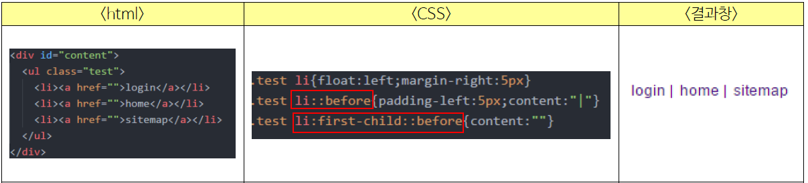
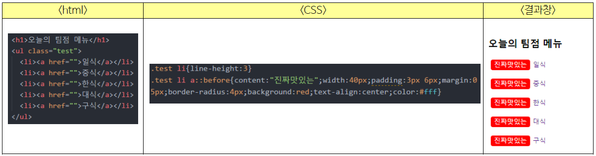
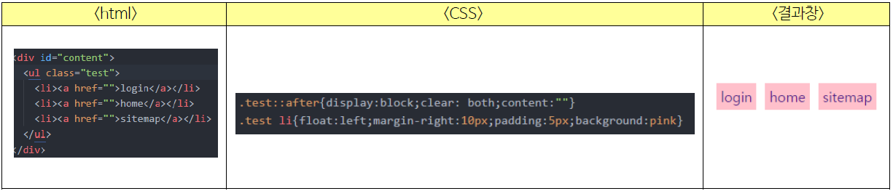

# 🎏after, before

- `::before` : 실제 내용 바로 앞에서 생성되는 자식요소
- `::after` : 실제 내용 바로 뒤에서 생성되는 자식요소​

## 📜::before와 ::after 활용​법

### 🏷gnb 구분 bar 넣기​

사용법 : li에 after와 content를 사용하여 바(|)를 선언 후, last-child를 이용하여 마지막 li의 content를 재선언 해줍니다.



### 🖼앞,뒤에 추가 정보를 넣는 방법

사용법 : 요소의 앞/뒤에 before 혹은 after를 선언합니다.. content=””에 넣고자 하는 문구를 입력해줍니다.



### 🧨float 해제방법​

사용법 : 부모요소에게 after를 사용하여 float 되어있는 요소를 clear해줍니다.



## 🎃Example

- z-index: -1;(암튼 음수)을 주면 content가 텍스트보다 뒤에 위치하게 됨

```html
<style>
  .box1:before {
    color: orange;
    content: "★";
    font-size: 3em;
    margin: -0.6em 0 -1em 0;
    position: absolute;
  }

  .box2:before {
    color: skyblue;
    z-index: -1;
    content: "★";
    font-size: 3em;
    margin: -0.6em 0 -1em 0;
    position: absolute;
  }
</style>

<div class="box1">어쩌구</div>
<br /><br />
<div class="box2">어쩌구</div>
```

> http://blog.hivelab.co.kr/%EA%B3%B5%EC%9C%A0before%EC%99%80after-%EA%B7%B8%EB%93%A4%EC%9D%98-%EC%A0%95%EC%B2%B4%EB%8A%94/
