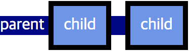

# 🖥display

모든 요소는 자기가 기본적으로 가지고 있는 display 값이 있습니다.

그리고 그 값에 따라 블록 레벨, 인라인 레벨 등 렌더링 박스의 유형이 결정됩니다.

display 속성으로 해당 요소의 렌더링 박스의 유형을 변경할 수 있으며 심지어

렌더링 여부도 결정할 수 있습니다.

display 속성을 잘 알아야 요소가 화면에 표현되는 방식을 이해하기 쉽습니다.

## 속성

- none

  요소가 렌더링 되지 않음

- inline

  inline level 요소처럼 렌더링

- block

  block level 요소처럼 렌더링

- inline-block

  inline level 요소처럼 렌더링(배치)되지만 block level의 성질을 가짐

  - height 나 width 등과 같은 박스모델 속성을 적용할 수 있다

그외에 list-item, flex, inline-flex, table, table-cell 등 다양한 속성 값 존재

inline level 요소 사이의 공백과 개행 처리 inline 요소의 경우 공백과 개행에 대해서 하나의 여백으로 받아들입니다. 따라서 inline와 inline-block의 경우 태그 사이의 공백이나 개행이 있을 경우 약 4px의 여백을 가지게 됩니다.

## display와 box model의 관계

### inline 요소의 padding/border 속성이 좌/우 만 적용 된다고 표시한 이유 추가 설명

실제로 inline 요소의 padding/border는 좌/우뿐만 아니라 상/하에도 적용이 됩니다.

parent 는 
, child 는 
하지만 상/하 padding/border는 line-box에는 영향을 주지 못하기 때문에 위와 같이 부모 요소의 박스에 반영되지 않습니다.

parent 는 
, child 는 

또한 인접한 다른 line-box 에도 반영되지않습니다. 즉 콘텐츠가 겹칠 수 있기 때문에 실무에서는 잘 사용하지 않습니다.
