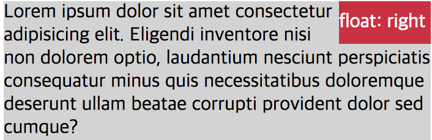

# float

요소를 float(요소를 보통의 흐름에서 벗어나게 함) 시킬지 지정하는 속성입니다.

기본 값 : none

```css
float: none | left | right | initial | inherit;
```

## 속성 값

- none

  float 시키지 않음(기본값)

- left

  좌측으로 float 시킴

- right

  우측으로 float 시킴

요소를 보통의 흐름에서 벗어나 띄어지게 함
주변 텍스트나 인라인 요소가 주위를 감싸는 특징이 있음



대부분 요소의 display 값을 block으로 변경함 (display 값 변경 예외: inline-table, flex 등)

## clear

floating 요소는 주변 요소들의 배치에도 영향을 줍니다.

그러므로 가끔 주변 요소들이 의도하지 않은 대로 나타날 수 있는데, clear 속성을 사용하여 이 문제를 해결할 수 있습니다.

의도한 게 아니라면 대부분 floating 요소 다음 요소에 바로 clear를 해주는 게 좋습니다.

clear는 float과 항상 따라다니는 속성이므로 같이 잘 알아두어야 합니다.

기본 값 : none

- none

  양쪽으로 floating 요소를 허용(기본값)

- left

  왼쪽으로 floating 요소를 허용하지 않음

- right

  오른쪽으로 floating 요소를 허용하지 않음

- both

  양쪽으로 floating 요소를 허용하지 않음
