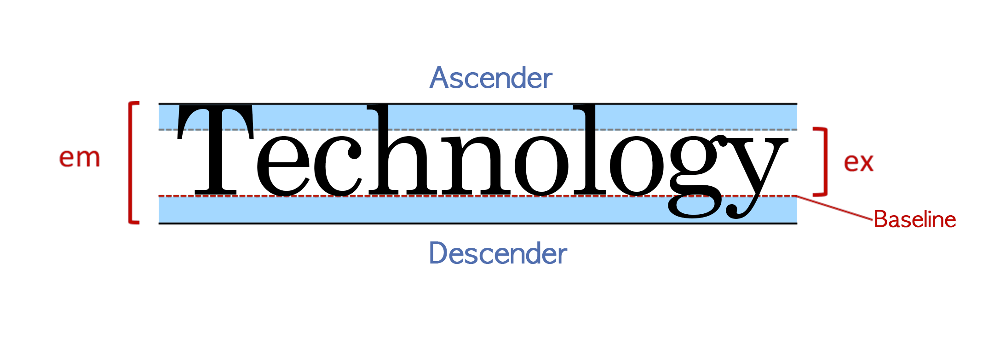

# 🗯Typography

## 타이포그래피의 구조

폰트를 이해하기 위해서는 타이포그래피의 구조를 먼저 이해해야 합니다.

모든 폰트는 em박스를 가지고 있고 위 그림과 같은 구조로 이루어져 있습니다.

- em 폰트의 전체 높이를 의미합니다.
- ex ( = x-height ) 해당 폰트의 영문 소문자 x의 높이를 의미합니다.
- Baseline 소문자 x를 기준으로 하단의 라인을 의미합니다.
- Descender 소문자에서 baseline 아래로 쳐지는 영역을 의미합니다. 서체에 따라 descender의 길이가 다릅니다. ( g, j, p, q, y )
- Ascender 소문자 x의 상단 라인 위로 넘어가는 영역을 의미합니다. ( b, d, h, l )
