# 🎹Flex box layout

## Flexbox의 장점

- 1줄의 코드 추가로 수평 정렬이 가능하다.
- 요소의 상하좌우 정렬, 순서 변경이 간단하다.
- 요소가 간격 조절이 간단하다.
- 서로 다른 height를 갖는 요소의 수평정렬 시, 간단히 상하중앙 정렬이 가능하다.

## Usage

Flexbox 레이아웃은 flex item이라 불리는 복수의 자식 요소와 이들을 내포하는 flex-container 부모 요소로 구성된다.


flexbox를 사용하기 위해서 HTML 부모 요소의 display 속성에 flex를 지정한다.

```css
.flex-container {
  display: flex;
}
```

부모 요소가 inline 요소인 경우 inline-flex을 지정한다.

```css
.flex-container {
  display: inline-flex;
}
```

flex 또는 inline-flex는 부모 요소에 반드시 지정해야하는 유일한 속성이며 자식 요소는 자동적으로 flex item이 된다.

## Flexbox container 속성

### flex-direction

#### `flex-direction: row;`

flex-direction 속성은 flex 컨테이너의 주축(main axis) 방향을 설정한다.

```css
.flex-container {
  flex-direction: row;
}
```


#### `flex-direction: row-reverse;`

```css
.flex-container {
  flex-direction: row-reverse;
}
```


#### `flex-direction: column;`

```css
.flex-container {
  flex-direction: column;
}
```


#### `flex-direction: column-reverse;`

```css
.flex-container {
  flex-direction: column-reverse;
}
```


### flex-wrap

flex-wrap 속성은 flex 컨테이너의 복수 flex item을 1행으로 또는 복수행으로 배치한다. flex-wrap 속성은 flex 컨테이너의 width보다 flex item들의 width의 합계가 더 큰 경우, 한줄로 표현할 것인지, 여러줄로 표현할 것인지를 지정한다.

#### `flex-wrap: nowrap;`

flex item을 개행하지 않고 1행에 배치한다. flex-wrap 속성의 기본값이다.

각 flex item의 폭은 flex container에 들어갈 수 있는 크기로 축소된다.

```css
.flex-container {
  flex-wrap: nowrap;
}
```


하지만 flex item들의 width의 합계가 flex 컨테이너의 width보다 큰 경우 flex 컨테이너를 넘치게 된다. 이때 `overflow: auto;`를 지정하면 가로 스크롤이 생기며 컨테이너를 넘치지 않는다.

#### `flex-wrap: wrap;`

flex item들의 width의 합계가 flex 컨테이너의 width보다 큰 경우, flex item을 복수행에 배치한다. 기본적으로 좌에서 우로, 위에서 아래로 배치된다.

```css
.flex-container {
  flex-wrap: wrap;
}
```


#### `flex-wrap: wrap-reverse;`

```css
.flex-container {
  flex-wrap: wrap-reverse;
}
```

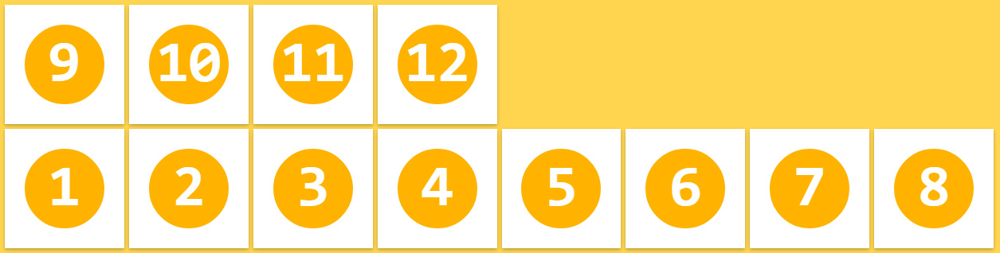

### flex-flow

flex-flow 속성은 flex-direction 속성과 flex-wrap 속성을 설정하기 위한 shorthand이다. 기본값은 row nowrap이다.

```css
.flex-container {
  flex-flow: <flex-direction> || <flex-wrap>;
}
```

### justify-content

flex container의 main axis를 기준으로 flex item을 수평 정렬한다.

#### `justify-content: flex-start;`

main start(좌측)를 기준으로 정렬한다. justify-content 속성의 기본값이다.

```css
.flex-container {
  justify-content: flex-start;
}
```

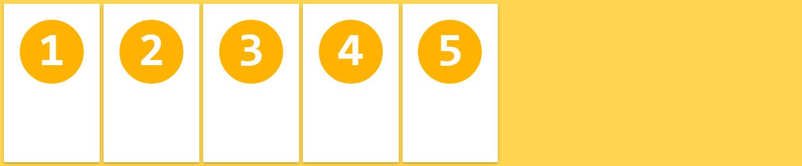

#### `justify-content: flex-end;`

main end(우측)를 기준으로 정렬한다.

```css
.flex-container {
  justify-content: flex-end;
}
```


#### `justify-content: center;`

flex container의 중앙에 정렬한다.

```css
.flex-container {
  justify-content: center;
}
```

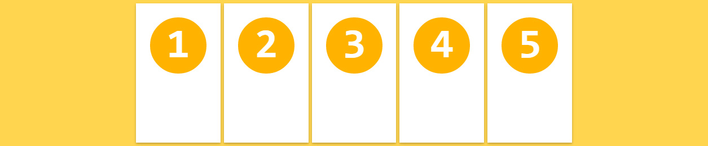

#### `justify-content: space-between;`

첫번째와 마지막 flex item은 좌우 측면에 정렬되고 나머지와 균등한 간격으로 정렬된다.

```css
.flex-container {
  justify-content: space-between;
}
```

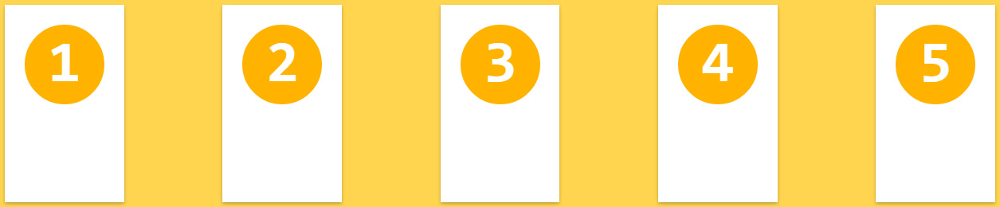

#### `justify-content: space-around;`

모든 flex item은 균등한 간격으로 정렬된다.

```css
.flex-container {
  justify-content: space-around;
}
```


### align-items

flex item을 flex container의 수직 방향(cross axis)으로 정렬한다. align-items 속성은 모든 flex item에 적용된다.

#### `align-items: stretch;`

모든 flex item은 flex container의 높이(cross start에서 cross end까지의 높이)에 꽉찬 높이를 갖는다. align-items 속성의 기본값이다.

```css
.flex-container {
  align-items: stretch;
}
```


#### `align-items: flex-start;`

모든 flex item은 flex container의 cross start 기준으로 정렬된다.

```css
.flex-container {
  align-items: flex-start;
}
```


#### `align-items: flex-end;`

모든 flex item은 flex container의 cross end 기준으로 정렬된다.

```css
.flex-container {
  align-items: flex-end;
}
```

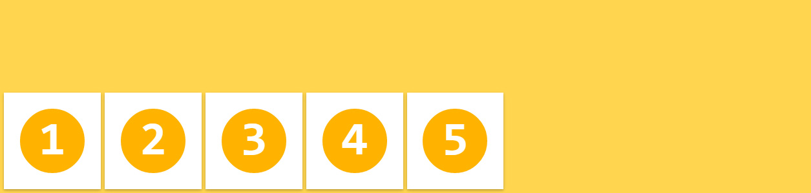

#### `align-items: center;`

모든 flex item은 flex container의 cross axis의 중앙에 정렬된다.

```css
.flex-container {
  align-items: center;
}
```


#### `align-items: baseline;`

모든 flex item은 flex container의 baseline을 기준으로 정렬된다.

```css
.flex-container {
  align-items: baseline;
}
```

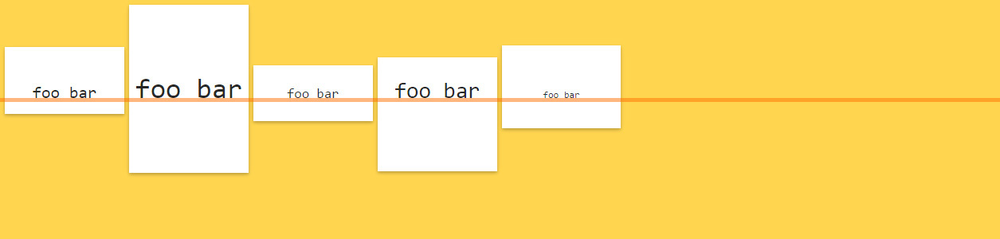

### align-content

flex container의 cross axis를 기준으로 flex item을 수직 정렬한다.

참고로 justify-content 속성은 flex container의 main axis를 기준으로 flex item을 수평 정렬한다.

#### `align-content: stretch;`

모든 flex item은 flex item의 행 이후에 균등하게 분배된 공간에 정렬되어 배치된다. align-content 속성의 기본값이다.

```css
.flex-container {
  align-content: stretch;
}
```

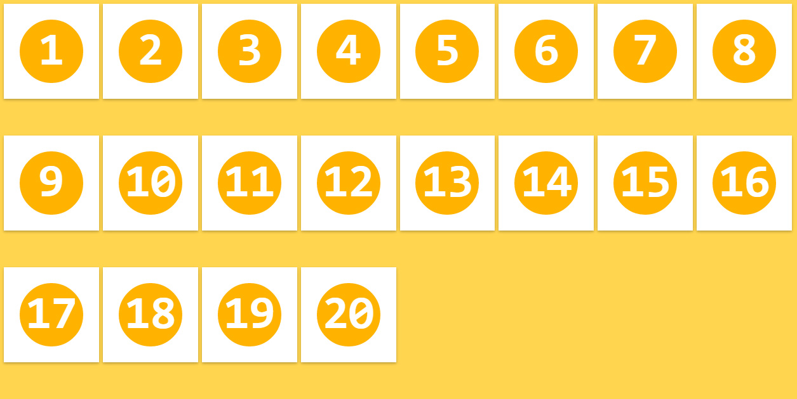

#### `align-content: flex-start;`

모든 flex item은 flex container의 cross start 기준으로 stack 정렬된다.

```css
.flex-container {
  align-content: flex-start;
}
```

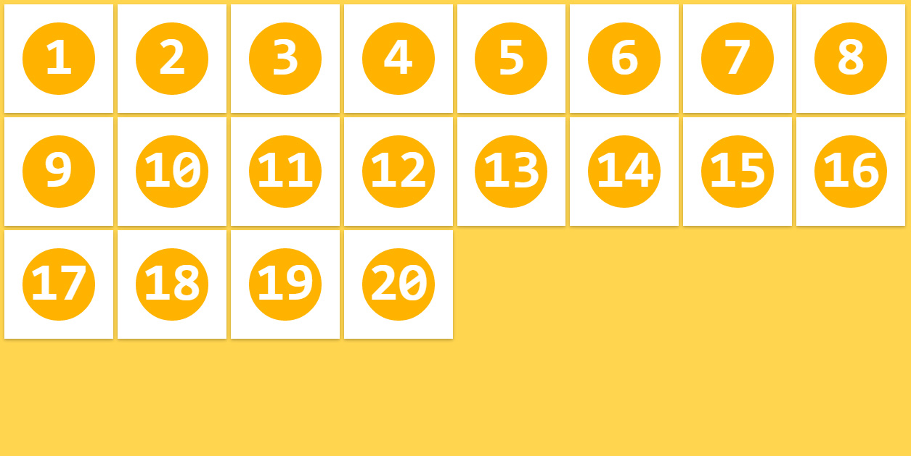

#### `align-content: flex-end;`

모든 flex item은 flex container의 cross end 기준으로 stack 정렬된다.

```css
.flex-container {
  align-content: flex-end;
}
```

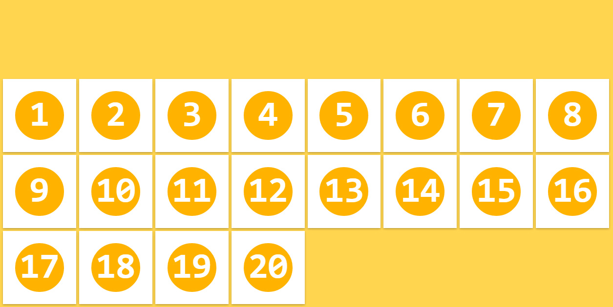

#### `align-content: center;`

모든 flex item은 flex container의 cross axis의 중앙에 stack 정렬된다.

```css
.flex-container {
  align-content: center;
}
```

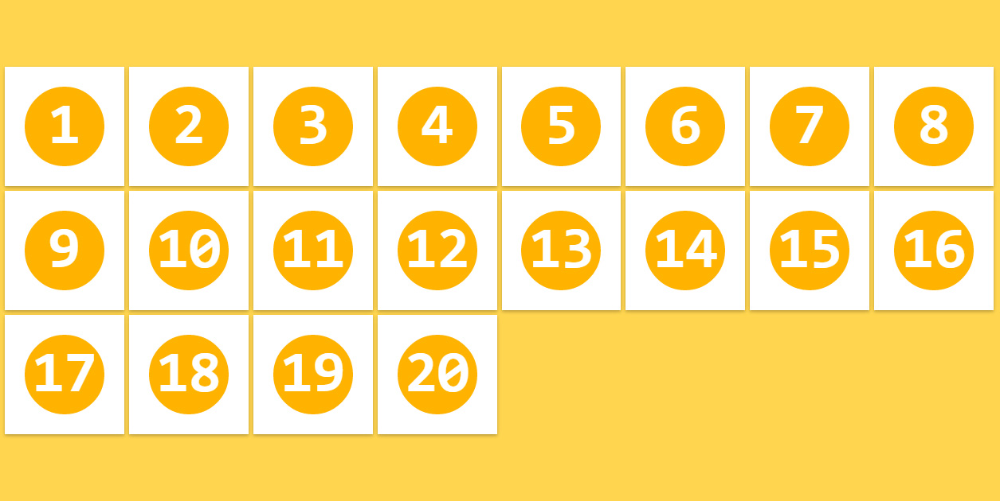

#### `align-content: space-between;`

첫번째 flex item의 행은 flex container의 상단에 마지막 flex item의 행은 flex container의 하단에 배치되며 나머지 행은 균등 분할된 공간에 배치 정렬된다.

```css
.flex-container {
  align-content: space-between;
}
```

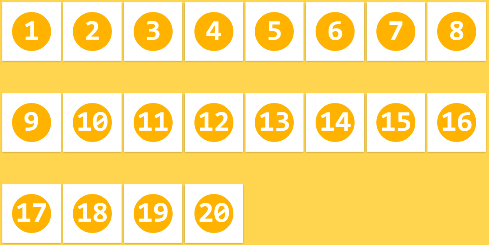

#### `align-content: space-around;`

모든 flex item은 균등 분할된 공간 내에 배치 정렬된다.

```css
.flex-container {
  align-content: space-around;
}
```

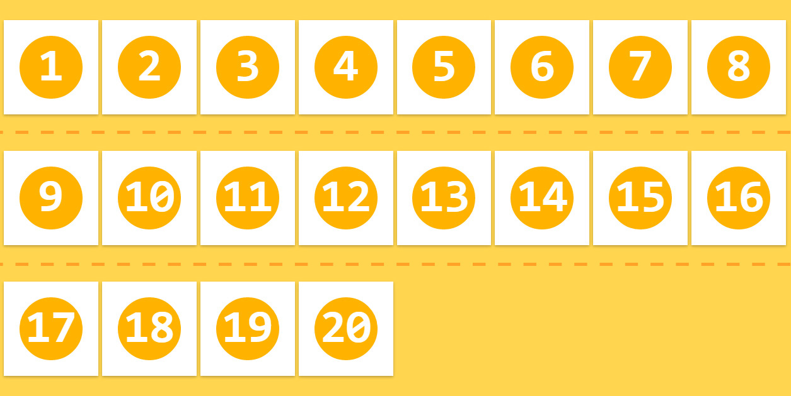

## Flexbox item 속성

float, clear, vertical-align 속성은 flex item에 영향을 주지 않는다.

### order

flex item의 배치 순서를 지정한다. HTML 코드를 변경하지 않고 order 속성값을 지정하는 것으로 간단히 재배치할 수 있다. 기본 배치 순서는 flex container에 추가된 순서이다. 기본값은 0이다.

```css
.flex-item {
  order: 정수값;
}
```


### flex-grow

flex item의 너비에 대한 확대 인자(flex grow factor)를 지정한다. 기본값은 0이고 음수값은 무효하다.

```css
.flex-item {
  flex-grow: 양의 정수값;
}
```

모든 flex item이 동일한 flex-grow 속성값을 가지면 모든 flex item은 동일한 너비를 갖는다.

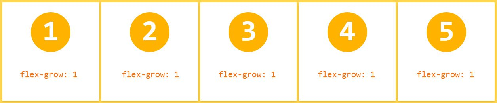

두번째 flex item의 flex-grow 속성값을 3으로 지정하면 다른 flex item보다 더 넓은 너비를 갖는다.

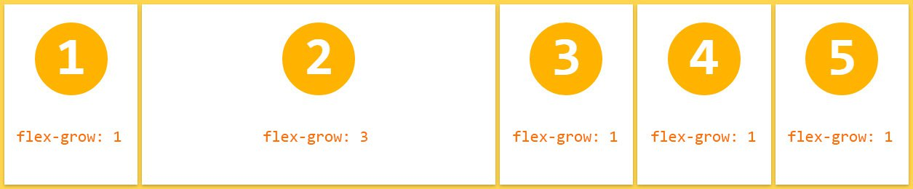

### flex-shrink

flex item의 너비에 대한 축소 인자(flex shrink factor)를 지정한다. 기본값은 1이고 음수값은 무효하다. 0을 지정하면 축소가 해제되어 원래의 너비를 유지한다.

```css
.flex-item {
  flex-shrink: 양의 정수값;
}
```

기본적으로 모든 flex item은 축소된 상태로 지정(기본값 1)하고 두번째 flex item만 축소를 해제(flex-shrink: 0;)하면 원래의 너비를 유지한다.


### flex-basis

flex item의 너비 기본값을 px, % 등의 단위로 지정한다. 기본값은 auto이다.

```css
.flex-item {
  flex-basis: auto | <width>;
}
```

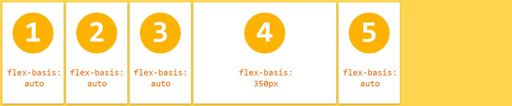

### flex

flex-grow, flex-shrink, flex-basis 속성의 shorthand이다. 기본값은 0 1 auto이다.

W3C에서는 이 속성을 사용하는 것 보다 개별적으로 기술하는 것을 추천하고 있다.

```css
.flex-item {
  flex: none | auto | [ <flex-grow> <flex-shrink>? || <flex-basis> ];
}
```

### align-self

align-items 속성(flex container속성으로 flex item을 flex container의 수직 방향(cross axis)으로 정렬한다.)보다 우선하여 개별 flex item을 정렬한다. 기본값은 auto이다.

```css
.flex-item {
  align-self: auto | flex-start | flex-end | center | baseline | stretch;
}
```

3번째, 4번째 flex item은 align-self 속성값이 우선 적용되어 정렬된다.


