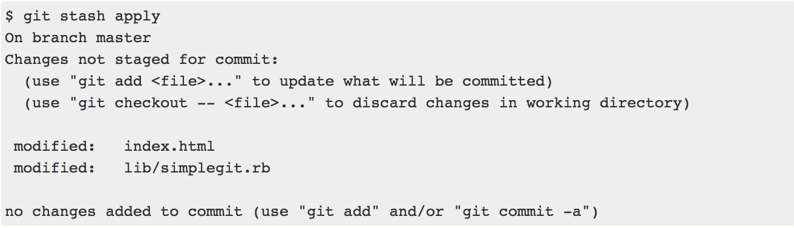

# 📼stash

아직 마무리하지 않은 작업을 스택에 잠시 저장할 수 있도록 하는 명령어이다. 이를 통해 아직 완료하지 않은 일을 commit하지 않고 나중에 다시 꺼내와 마무리할 수 있다.

- git stash 명령을 사용하면 워킹 디렉토리에서 수정한 파일들만 저장한다.
- stash란 아래에 해당하는 파일들을 보관해두는 장소 이다.

  - Modified이면서 Tracked 상태인 파일

    - Tracked 상태인 파일을 수정한 경우

      Tracked: 과거에 이미 commit하여 스냅샷에 넣어진 관리 대상 상태의 파일

  - Staging Area에 있는 파일(Staged 상태의 파일)
    - git add 명령을 실행한 경우
    - Staged 상태로 만들려면 git add 명령을 실행해야 한다.
    - git add는 파일을 새로 추적할 때도 사용하고 수정한 파일을 Staged 상태로 만들 때도 사용한다.

## git stash 하던 작업 임시로 저장하기

staging area에 있는 파일과 tracked 상태이면서 modified한 파일을 stash에 넣는다.

```shell
// working directory에 있는 파일의 상태 확인
$ git status
Changes to be committed:
(use "git reset HEAD <file>..." to unstage)
modified:   index.html
Changes not staged for commit:
(use "git add <file>..." to update what will be committed)
(use "git checkout -- <file>..." to discard changes in working directory)
modified:   lib/simplegit.rb
```

`git stash` 나 `git stash save` 를 실행하면 스택에 새로운 stash가 만들어지고 working directory는 깨끗해진다.

```shell
$ git stash
$ git stash save
```

## stash 목록 확인하기

```shell
$ git stash list
stash@{0}: WIP on master: 049d078 added the index file
stash@{1}: WIP on master: c264051 Revert "added file_size"
stash@{2}: WIP on master: 21d80a5 added number to log
```

## stash 적용하기

```shell
// 가장 최근의 stash를 가져와 적용한다.
$ git stash apply
// stash 이름(ex. stash@{2})에 해당하는 stash를 적용한다.
$ git stash apply [stash 이름]
```

위 명령어는 staged상태였던 파일들을 다시 staged상태로 만들어주지 않는다.

--index 옵션을 주면 staged상태까지 복원한다.

```shell
// Staged 상태까지 저장
$ git stash apply --index
```




수정했던 파일들을 복원할 때 반드시 stash했을 때와 같은 브랜치일 필요는 없다. 만약 다른 작업 중이던 브랜치에 이전의 작업들을 추가했을 때 충돌이 있으면 알려준다.

## stash 제거하기

apply 옵션은 단순히 stash를 적용하는 것으로, 해당 stash는 스택에 여전히 남아있다. 스택에 남아 있는 stash는 위의 명령어을 사용하여 제거할 수 있다.

```shell
// 가장 최근의 stash를 제거한다.
$ git stash drop
// stash 이름(ex. stash@{2})에 해당하는 stash를 제거한다.
$ git stash drop [stash 이름]
```

적용과 동시에 제거하고 싶으면 `git stash pop`을 사용하면 된다.

```shell
$ git stash pop
```

## stash 되돌리기

`git stash show -p | git apply -R`
실수로 잘못 stash 적용한 것을 되돌리고 싶으면 위의 명령어를 이용한다.

```shell
// 가장 최근의 stash를 사용하여 패치를 만들고 그것을 거꾸로 적용한다.
$ git stash show -p | git apply -R
// stash 이름(ex. stash@{2})에 해당하는 stash를 이용하여 거꾸로 적용한다.
$ git stash show -p [stash 이름] | git apply -R
```

TIP alias로 편리하게 사용할 수 있다.
stash-unapply라는 명령어를 등록하여 간단하게 사용할 수 있다.

```shell
$ git config --global alias.stash-unapply '!git stash show -p | git apply -R'
$ git stash apply
$ #... work work work
// alias로 등록한 stash 되돌리기 명령어
$ git stash-unapply
```
