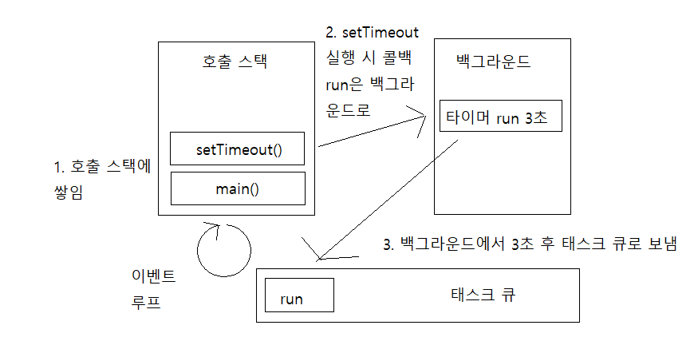
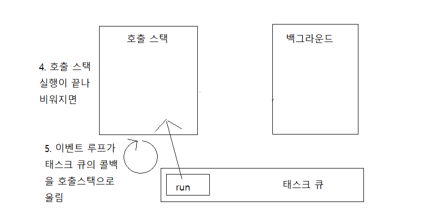
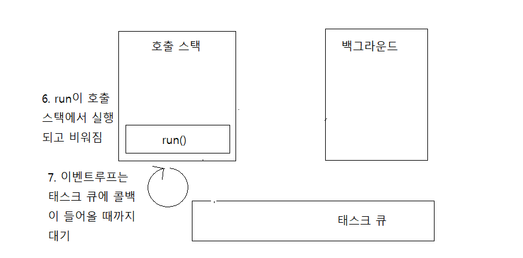

# 이벤트 루프, 호출 스택

## 호출 스택

```javascript
function first() {
  second();
  console.log("첫 번째");
}
function second() {
  third();
  console.log("두 번째");
}
function third() {
  console.log("세 번째");
}
first();
third();
```

1. main() - 전역 컨텍스트 생성
2. main() -> first() -> second() -> third() 순으로 호출 스택에 쌓임
3. 호출된 순서의 반대로 실행 LIFO(마지막에 들어온 것이 먼저 나감)
4. 순서대로 third()까지 실행되고 main()이 남으면 마지막으로 third()가 스택에 들어감
5. Uncaught RangeError: Maximum call stack size exceeded 호출 스택에 제한이 있음(보톤 재귀 함수로 문제 발생, 만개정도로 생각)

## 이벤트 루프

자바스크립트는 보통 싱글 쓰레드라고 불리는데, 바로 메인 쓰레드인 이벤트 루프가 싱글 쓰레드

```javascript
function run() {
  console.log("동작");
}
console.log("시작");
setTimeout(run, 0);
console.log("끝");
```

시작, 끝, 동작이 찍힘





> [zerocho eventloop](https://www.zerocho.com/category/JavaScript/post/597f34bbb428530018e8e6e2)

> [TOAST MEETUP eventloop](https://meetup.toast.com/posts/89)
